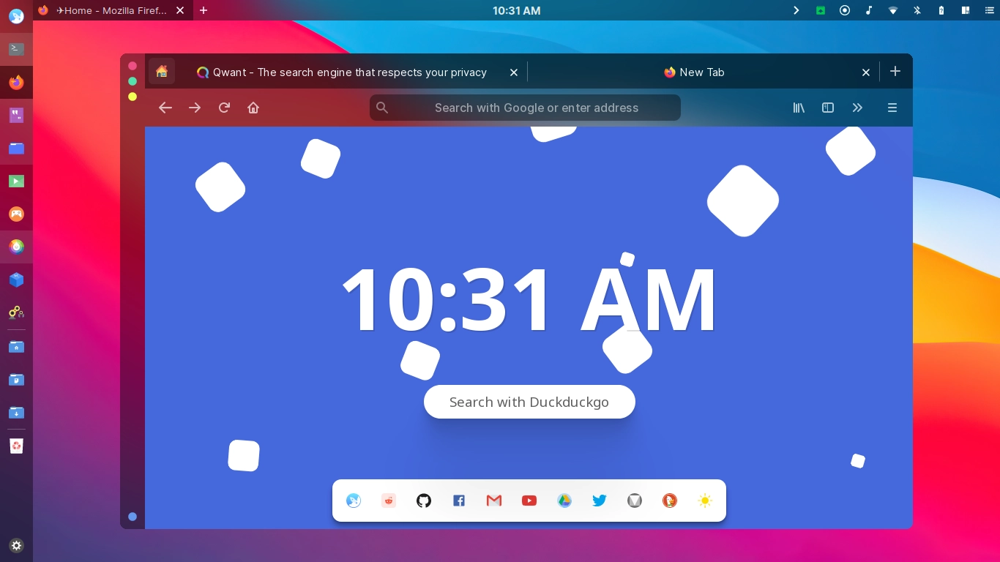

## squareup

### A sleek and modern startpage

## [Live Demo](https://manilarome.github.io/squareup/)

<p align='center'>
	
	<br/>
	<i>
		squareup startpage
	</i>
</p>

## Features

+ Responsive UI
+ Web Search Suggestions
+ Mobile Support
+ Theme Switcher
+ Keyboard navigation
+ Search Engine Selection
+ Animated Background
+ Web Menu with Fuzzy Search
+ Vanilla Javascript!
+ And many bugs!

## Usage

+ Clone this repo.
+ Set it as your default homepage.

## Keybindings

+ <kbd>Escape</kbd> - toggles web menu
+ <kbd>Control + Space</kbd> - switches search engine
+ <kbd>Alt + Space</kbd> - switches color scheme

## Quick search

+ `r/` + `subreddit name` will open the subreddit if valid or existing.
	- `r/unixporn`
	- `r/startpages`

+ `w/` + `search query` to search on wikipedia.
	- `w/linux`
	- `w/Javascript`

+ `u/` + `search query` to search for an image/photo on unsplash.
	- `u/nature`
	- `u/technology`

+ `a/` + `search query` to search a product on amazon.
	- `a/intel celeron`
	- `a/windows 10 source code`

+ `e/` + `search query` to search a product on ebay.
	- `e/pentium 4`
	- `e/uranium core`

+ `y/` + `search query` to search a video on youtube.
	- `y/how to build a nuclear reactor`
	- `y/strange alien sightings in oregon`

+ `n/` + `comic id` to search a "comic" on a certain "comic" website.
	- `n/177013`

+ `g/` + `search query` to search a for a repo/user on github.
	- `g/manilarome`
	- `g/squareup`
	- `g/manilarome/squareup`

## URL Redirects

Searching a valid URL will redirect you to the said URL. Note that a protocol, `https://` for example, is required.

+ `https://haveibeenpwned.com/` query is valid, so you will be redirected to [https://haveibeenpwned.com/](https://haveibeenpwned.com/).
+ `google.com` is not a valid URL, so it will search it on your default search engine.
+ `www.duckduckgo.com` is also invalid because it doesn't have a protocol.

## URL Query Parameters

You can also pass a query by using the `q` parameter. The default search engine will be used.

+ `manilarome.github.io/squareup?q=how to build a nuclear reactor at home`
+ `127.0.0.1?q=how to download more RAM in google play store`
+ `file:///PATH/TO/squareup/index.html?q=how to restore system32`

## Settings and Customization

### Customizing color scheme

Change the color scheme by just clicking a button!

+ `Dark` - Dark colorscheme. Good for the night.
+ `Light` - Bright colorscheme. Good for killing the eyes.
+ `Auto` - Load a colorscheme based on time. Edit light/dark mode hours on `js/config.js` 

#### Customizing panel buttons

To add more web shortcuts/buttons on the dock, you have to edit the `panelSites` array in `js/config.js`. Make sure to put an icon with `svg` format for the shortcut in `assets/webcons/` folder.

```js
// Example
const panelSites = [
	{
		site: 'Reddit',
		icon: 'reddit',
		url: 'https://reddit.com/'
	},
	...
]
```

#### Customizing web menu

Add more items or web shortcuts in the web menu by editing the `webSites` array in `js/config.js`. Make sure to put an icon with `svg` format for the shortcut in `assets/webcons/` folder. 

```js
// Example
const webSites = [
	{
		site: 'Reddit',
		icon: 'reddit',
		url: 'https://reddit.com/',
		category: 'social'
	},
	...
]
```

#### Customizing quick search

Add more quick search shortcuts by editing the `quickSearchData` object in `js/config.js`. Make sure to follow the format below:

```js
// Example
const quickSearchData = {
	'r/': {
		urlPrefix: 'https://reddit.com/r/'
	},
	...
}
```

#### Switch default search engine

Startpage is the default search engine, if you want to change it, just click the switcher button on the panel.

Available search engines:

+ Startpage
+ Qwant
+ Ecosia
+ Duckduckgo
+ Yahoo
+ Google
+ Bing

#### Customizing available search engines

Add more search engine by editing the `searchEngines` object in `js/config.js`. Make sure to follow the format below:

```js
// Example
const searchEngines = {
	'duckduckgo': {
		name: 'Duckduckgo',
		prefix: 'https://duckduckgo.com/?q='
	},
	...
}
```

#### Changing clock mode

There are two clock modes available - `24-hour` and `12-hour`. Switch between clock modes by just clicking on the clock. Simple.

### Important Note

+ Make sure that javascript is enabled in your browser!
+ Make sure to whitelist or disable `NoScript` and `Dark Mode Reader` extensions on this homepage.
+ If you are experiencing slowdowns, you can disable the animations in `css/animated-background.css`.
+ Tested only on Firefox and Google Chrome.

### TODOs

Squareup will sit between minimal and bloated. The items in this TODO list are the only one I'm planning to implement in this homepage.

- [x] Search engine switching
- [x] Autosuggestion
- [x] Categorized Web Menu


### Issues? 

Feel free to open one!

### PR?

That would be great!

### Other works

Check my other works related to this startpage.

+ [blurredfox](https://github.com/manilarome/blurredfox/) - a gorgeous and modern firefox CSS theme.
+ [the-glorious-startpage](https://github.com/manilarome/the-glorious-startpage) - my very first startpage. Kinda bloaty and code is quite messy but still kinda works and looks gorgeous.
+ [the-glorious-dotfiles](https://github.com/manilarome/the-glorious-dotfiles) - a stash of my configurations.
